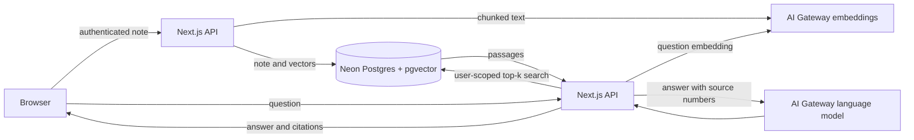

# Evidenote

**Knowledge you can verify.** Evidenote is a private, evidence-grounded learning workspace: save your notes, ask questions across them, and inspect the passages behind every answer.

## Why this project

Most AI study tools ask users to trust a generated answer. Evidenote makes the evidence visible and gives people control to export or delete their study data. It is a full-stack portfolio project focused on retrieval quality, user-scoped data access, and transparent AI data flows.

## Features

- Sign in and keep study notes and Q&A scoped to your account.
- Paste notes or import `.txt` and `.md` files.
- Create overlapping text chunks and 1,536-dimensional embeddings.
- Retrieve relevant passages with PostgreSQL, pgvector, and cosine HNSW search.
- Generate answers through the Vercel AI SDK and AI Gateway, with source passages shown in the UI.
- Export your notes and study history as JSON, or delete that study data from the app.

## Architecture



Notes are saved with their indexed chunks in one database transaction. Retrieval filters by the authenticated user in the query function. Read the [system design](docs/SYSTEM_DESIGN.md) and [privacy/data flow](docs/PRIVACY.md) before extending the project.

## Run locally

Requirements: Node.js 20+, pnpm, a Neon Postgres database, and a Vercel AI Gateway key.

```bash
pnpm install
cp .env.example .env.local
```

Set `AUTH_SECRET`, `POSTGRES_URL`, and `AI_GATEWAY_API_KEY` in `.env.local`, then run:

```bash
pnpm db:migrate
pnpm dev
```

Open [http://localhost:3000/study](http://localhost:3000/study). The starter creates a guest session; register an account to keep data under a persistent account. See [Database and AI setup](docs/DATABASE_AND_AI.md) for credentials, migrations, and deployment.

## Engineering notes

This is a portfolio MVP, not a claim of production scale. Indexing runs synchronously and note input is capped. The [system design](docs/SYSTEM_DESIGN.md) explains the current tradeoffs and a scale-up path; the [portfolio guide](docs/PORTFOLIO.md) has accurate resume bullets and interview discussion points.

The model receives note text for embeddings and retrieved passages for answer generation. Evidenote does not currently provide offline or on-device AI. Review [Privacy and data flow](docs/PRIVACY.md) before using sensitive material.

## Roadmap

Next steps include course organization, PDF extraction, asynchronous indexing, flashcards, and a retrieval evaluation set. See the [roadmap](docs/ROADMAP.md) and [AI development workflow](docs/AI_WORKFLOW.md).

## Attribution

Evidenote is derived from [Vercel's Chatbot template](https://github.com/vercel/chatbot). The upstream Apache License 2.0 is retained in [LICENSE](LICENSE); see [NOTICE](NOTICE) for attribution and the changes made.

