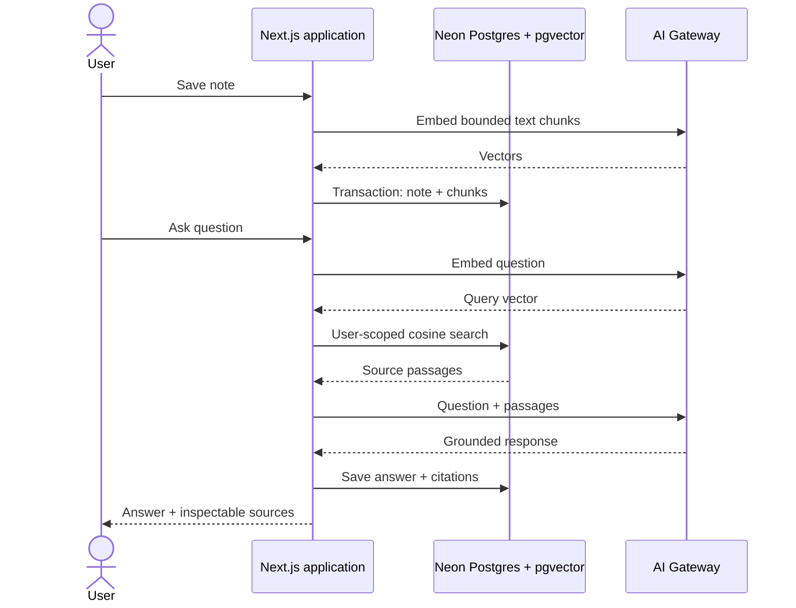

# System design

## Request paths

### Ingest a note

1. Auth.js supplies the signed-in user ID to the server route.
2. The route validates the title and content, limits input to 50,000 characters, and splits text into overlapping chunks.
3. AI Gateway creates 1,536-dimensional embeddings for the chunks.
4. One Postgres transaction stores the note and its chunks. The vector index supports cosine similarity search.

### Ask a question

1. The route embeds the question.
2. `match_study_chunks` retrieves up to six closest chunks and filters both the chunk and parent note by the signed-in user ID.
3. The server gives the question and retrieved passages to the configured language model. The prompt asks it to treat note content as untrusted reference text and cite its sources.
4. The answer and source passages are stored as study history and returned to the UI.

## Boundaries and guarantees

- Authentication is checked in each study API route.
- Reads, writes, and retrieval are scoped to the authenticated user ID. The current version enforces this in server queries and the SQL function; it does not use PostgreSQL row-level security.
- Note and chunk creation is transactional. Deleting a note relies on foreign-key cascades to remove its chunks.
- Study-data export and deletion cover notes and study history only. They do not delete the user's account or the template's separate chat history.
- The model sees note chunks when they are embedded and retrieved passages when it answers. This is a server-backed AI product, not on-device AI.

## Tradeoffs and next scale step

Indexing is synchronous to keep the starter small and understandable. A 50,000-character cap and 70-chunk cap bound one request, but large collections could exceed request timeouts or create bursts of AI calls. The next step is a durable job queue: accept an idempotent import, store an explicit indexing state, process with bounded concurrency, retry transient failures, and let the UI poll progress. Keep deletion able to cancel or invalidate queued jobs.

The HNSW index makes approximate vector search practical as the collection grows, but it is not a quality guarantee. Build a labeled retrieval set and measure Recall@k or MRR before tuning chunk sizes, similarity thresholds, or index parameters. Track latency and token/call costs by operation without logging note content.

## Interview discussion

- **Scale:** move embeddings off the request path, bound queue depth, batch provider calls, and design idempotent retries.
- **Correctness:** preserve the user filter in every read and retrieval path; test cross-account access and deletion behavior before launch.
- **Privacy:** disclose provider data flows, minimize content in logs, and keep export/deletion behavior explicit.
- **Product:** show source passages and a useful no-evidence response rather than presenting model confidence as fact.

For the product's current data-flow statement, see [Privacy and data flow](PRIVACY.md).
